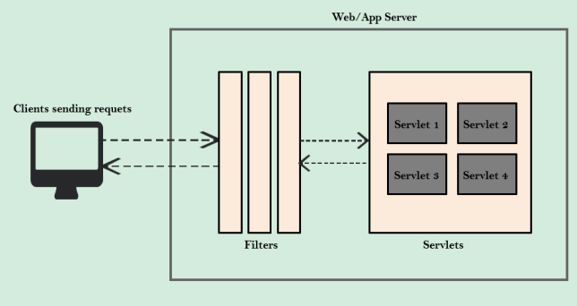
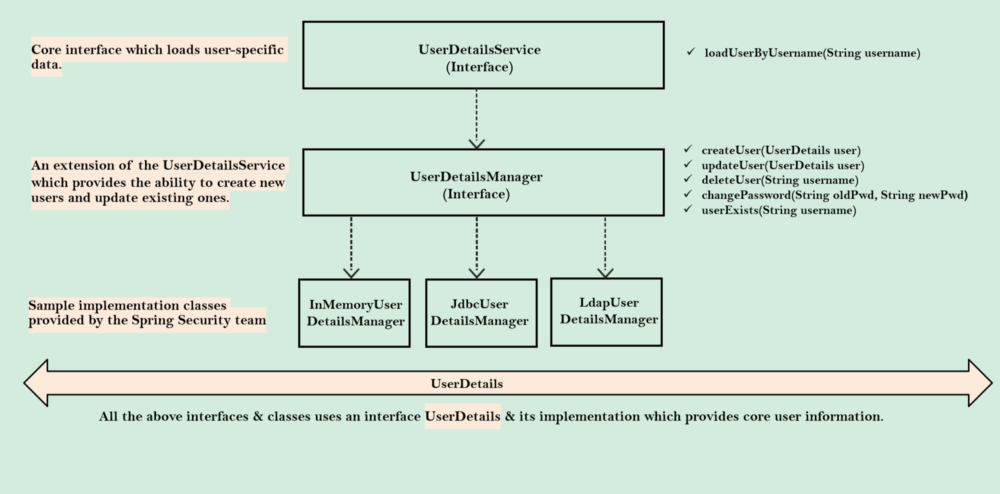
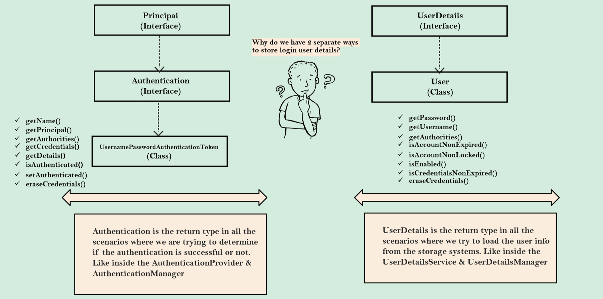

# Spring Security

생성자: 범진 최
생성 일시: 2024년 4월 13일 오후 1:30
태그: 시큐리티 강의

## 왜 Spring 사용자들은 Spring Security 를 선택 할까?

1. 애플리케이션 보안은 개발자가 개발한 코드/프레임워크로 구현하는 것이 번거럽고 어렵다
2. 보안에 능숙한 Spring Security팀이 모든 보안 시나리오를 고려하여 구축했다.
3. 최소한의 구성으로 page/api 경로 등을 보호하며, 권한,메서드 수준 보안 등을 쉽게 적용할 수 있다.
4. CSRF, CORS등과 같은 일반적인 보안 취약점을 처리 해주고 만약 취약점이 발견되면 프레임워크에 즉시 패치를 진행한다→ 빠른패치
5. 계정 인증,jwt인증, Outh인증,OpenId등 다양한 보안 표준을 지원한다.

## 서블렛과 필터

### 웹 애플리케이션 내부의 일반적인 시나리오

Java 웹 앱에서 서블릿 컨테이너(웹 서버)는 Java 코드가 이해할 수 있도록 HTTP 메시지를 번역하는 작업을 처리합니다. 가장 많이 사용되는 서블릿 컨테이너 중 하나는 Apache Tomcat입니다. 서블릿 컨테이너는 HTTP 메시지를 서블릿 요청으로 변환하여 매개변수로 서블릿 메서드에 전달합니다. 마찬가지로 서블릿 응답은 서블릿으로부터 서블릿 컨테이너에 출력으로 반환됩니다. 따라서 Java 내부에서 작성하는 모든 웹 앱은 모두 서블릿에 의해 구동됩니다.

### 필터의 역할

Java zveb 애플리케이션 내부의 필터는 각 요청/응답을 가로채고 비즈니스 로직 이전에 몇 가지 사전 작업을 수행하는 데 사용할 수 있습니다. 따라서 동일한 필터를 사용하여 Spring Security는 웹 애플리케이션 내부의 구성을 기반으로 보안을 강화합니다.

## 스프링 시큐리티 내부 흐름

### 스프링 시큐리티 필터

스프링 시큐리티는 각 요청을 가로채는 필터 체인을 통해 인증이 필요한지 여부를 판단합니다. 인증이 필요한 경우, 사용자를 로그인 페이지로 리다이렉트하거나 이전 인증 세션에서 저장된 정보를 재사용합니다.

### Authentication

UsernamePasswordAuthenticationFilter와 같은 필터는 HTTP 요청에서 사용자 이름/비밀번호를 추출하고 Authentication 타입의 객체를 준비합니다. Authentication은 인증된 사용자 세부 정보를 저장하는 핵심 표준이기 때문입니다.

### AuthenticationManager

필터로부터 요청을 받은 인증 매니저는 사용자 세부 정보의 유효성을 검사하기 위해 등록된 인증 제공자들에게 요청을 위임합니다. 애플리케이션에 다수의 인증 제공자가 존재할 수 있기 때문에, 인증 매니저가 이들을 적절히 관리하는 역할을 합니다.

### AuthenticationProvider

필터로부터 요청을 받은 인증 매니저는 사용자 세부 정보의 유효성을 검사하기 위해 등록된 인증 제공자들에게 요청을 위임합니다. 애플리케이션에 다수의 인증 제공자가 존재할 수 있기 때문에, 인증 매니저가 이들을 적절히 관리하는 역할을 합니다.

### UserDetailsManager/UserDetailsService

UserDetailsManager 또는 UserDetailsService는 데이터베이스나 다른 저장소 시스템에서 사용자 세부 정보를 관리(검색, 생성, 수정, 삭제)하는 기능을 제공합니다.

### PasswordEncoder

PasswordEncoder 인터페이스는 비밀번호를 인코딩하고 해싱하는 역할을 합니다. 이는 평문 비밀번호를 보안 위험으로부터 보호하는 데 필수적입니다.

### SecurityContext

요청이 성공적으로 인증을 거친 후, 해당 인증 정보는 보통 SecurityContextHolder에 의해 관리되는 스레드 로컬 보안 컨텍스트에 저장됩니다. 이는 동일 사용자의 후속 요청을 처리할 때 컨텍스트를 유지하는 데 도움을 줍니다.

## 시퀸스 플로우

### Spring Security 기본 동작

1. **보안 페이지에 대한 초기 요청**: 사용자가 처음으로 보안 페이지에 접근하려고 할 때, 요청은 여러 보안 필터를 거칩니다.
2. **필터에 의한 감지 및 리다이렉션**: **`AuthorizationFilter`** 및 **`DefaultLoginPageGeneratingFilter`**와 같은 필터는 사용자가 로그인하지 않았다는 것을 감지하고 로그인 페이지로 리다이렉션합니다.
3. **사용자 자격 증명 제출**: 사용자가 로그인 페이지에서 자격 증명을 입력하면, 로그인 시도를 처리하기 위해 설계된 보안 필터가 요청을 가로챕니다.
4. **추출 및 토큰 형성**: **`UsernamePasswordAuthenticationFilter`**와 같은 필터는 요청에서 사용자 이름과 비밀번호를 추출합니다. 이 정보는 **`Authentication`** 인터페이스의 구현체인 **`UsernamePasswordAuthenticationToken`**을 형성하는 데 사용됩니다.
5. **ProviderManager에 의한 인증 시도**: 이 토큰은 **`AuthenticationManager`**의 구현체인 **`ProviderManager`**에 전달됩니다. **`ProviderManager`**는 주어진 인증 토큰 유형을 지원하는 사용 가능한 **`AuthenticationProvider`** 목록을 식별합니다.
6. **사용자 세부 정보 검색 및 비밀번호 검증**: 일반적으로 이 단계에서는 **`DaoAuthenticationProvider`**가 관여합니다. 이는 **`UserDetailsService`**(예: **`InMemoryUserDetailsManager`**)를 사용하여 메모리에서 사용자 세부 정보를 로드합니다. 검색된 사용자 세부 정보에는 저장된 비밀번호가 포함되어 있으며, 시스템은 제공된 비밀번호와 저장된 비밀번호를 기본 비밀번호 인코더를 사용하여 비교합니다.
7. **인증 성공 또는 실패**: 비밀번호와 사용자 이름이 정확하면 **`DaoAuthenticationProvider`**는 사용자의 인증을 확인하고 성공적인 인증을 나타내는 채워진 **`Authentication`** 객체를 생성합니다. 이 객체에는 사용자의 권한 및 자격 증명과 같은 세부 정보가 포함됩니다.
8. **인증 결과 처리**: **`ProviderManager`**는 결과를 처리합니다. 인증이 실패하면 다른 사용 가능한 제공자로 인증을 시도할 수 있습니다. 성공하면 인증 세부 정보를 필터를 통해 다시 전달합니다.
9. **인증 저장 및 응답**: 인증에 성공하면 **`Authentication`** 객체는 **`SecurityContextHolder`**에 의해 유지되는 **`SecurityContext`**에 저장됩니다. 이 저장소는 일반적으로 스레드 로컬이며, 사용자의 보안 컨텍스트가 세션 전체에 걸쳐 유지되도록 합니다. 인증 실패 시 리다이렉션(인증 실패 시) 또는 성공적인 접근을 나타내는 응답이 사용자에게 반환됩니다.

### USER MANAGEMENT 주요 클래스 &

### USERDETAILS & AUTHENTICATION 사이의 관계

"Authentication 객체는 인증 과정이 성공했는지 여부를 판단해야 하는 모든 상황에서의 반환 타입입니다. 예를 들어 AuthenticationProvider와 AuthenticationManager가 이에 해당합니다."

"UserDetails 객체는 저장 시스템에서 사용자 정보를 로딩해야 하는 모든 상황에서의 반환 타입입니다. UserDetailsService와 UserDetailsManager가 작업을 처리할 때 주로 사용됩니다."
## 인코딩 Vs 암호화 Vs 해싱

### **인코딩**

- **목적**: 데이터를 한 형식에서 다른 형식으로 변환하는 과정입니다. 이는 데이터의 전송이나 저장을 용이하게 하기 위해 사용됩니다.
- **가역성**: 인코딩 과정은 완전히 가역적이며, 누구나 쉽게 원래의 데이터로 복원할 수 있습니다.
- **적용 예**: 동영상, 이미지, 음성 파일 등 미디어 콘텐츠의 압축 및 변환에 주로 사용됩니다.
- **기술**: ASCII, Base64, Unicode 등이 일반적인 인코딩 방식입니다.
- **보안성**: 기밀성을 제공하지 않으므로, 비밀번호 같은 민감한 정보의 보호에는 적합하지 않습니다.

### **암호화**

- **목적**: 데이터의 기밀성을 유지하기 위해 일반 데이터를 암호화된 형태로 변환합니다.
- **가역성**: 특정 알고리즘과 비밀키를 사용하여 데이터를 암호화하고, 같은 키를 사용하여 데이터를 복호화합니다.
- **적용 예**: 주로 서버에 저장되는 민감한 정보(개인정보, 금융정보 등)의 보호에 사용됩니다.
- **보안성**: 비밀키가 유출될 경우, 암호화된 데이터가 해독될 위험이 있습니다. 따라서, 키 관리가 매우 중요합니다.

### **해싱**

- **목적**: 데이터를 원본을 유추하기 어렵거나 불가능한 해시값으로 변환하여 보안을 강화합니다.
- **가역성**: 해싱 과정은 비가역적으로, 해시값을 통해 원본 데이터를 복원할 수 없습니다.
- **적용 예**: 비밀번호 검증, 무결성 검사 등에 사용됩니다. 사용자가 입력한 비밀번호를 해시값으로 변환하고, 이를 데이터베이스에 저장된 해시값과 비교합니다.
- **보안성**: 해시값만으로는 원본 데이터를 알아낼 수 없으므로, 데이터의 안전성이 매우 높습니다.

## **PasswordEncoder** Interface

**`PasswordEncoder`** 인터페이스는 보안 관련 프로그래밍에서 중요한 역할을 하며, 비밀번호 저장 방식을 규정합니다. 이 인터페이스는 주로 두 개의 추상 메소드와 한 개의 기본 메서드를 포함합니다. 여기에는 다양한 구현체가 존재하며, 각각은 다른 보안 목적과 환경에 적합합니다.

### **구현체**

1. **NoOpPasswordEncoder**
    - 이 구현체는 비밀번호를 일반 텍스트로 취급하며, 주로 테스트 환경에서 사용됩니다. 실제 운영 환경에서의 사용은 권장되지 않습니다.
2. **StandardPasswordEncoder**
    - 레거시 보안 알고리즘을 구현한 PasswordEncoder로, 주로 과거 코드와의 호환성을 위해 사용됩니다. 현재는 보안 수준이 낮아 사용을 권장하지 않습니다.
3. **Pbkdf2PasswordEncoder**
    - 이전에는 안정적이라고 여겨졌으나, 현재는 보다 강력한 알고리즘으로 대체되고 있습니다. PBKDF2 알고리즘은 솔트(salt)와 반복 횟수를 사용하여 비밀번호를 해싱합니다.
4. **BCryptPasswordEncoder**
    - BCrypt 해싱 함수를 사용하며, CPU 집약적인 연산을 요구합니다. 이는 무차별 공격(brute-force attack)에 대한 저항력을 높이는 데 도움이 됩니다. 보안이 강화된 현대적인 애플리케이션에 권장됩니다.
5. **SCryptPasswordEncoder**
    - BCryptPasswordEncoder의 기능에 메모리 할당을 추가하여, 공격자가 더 많은 리소스(특히 메모리)를 사용하도록 요구합니다. 이로 인해 해킹 시도가 더 어려워지고, SCrypt는 메모리 경합을 통해 추가 보안을 제공합니다.
6. **Argon2PasswordEncoder**
    - BCrypt와 SCrypt의 특성을 합친 최신 해싱 방식으로, CPU와 메모리, 그리고 다중 스레드를 통해 높은 수준의 보안을 제공합니다. Argon2는 2015년 비밀번호 해싱 경연대회에서 우승한 알고리즘으로, 현대의 다양한 공격 시나리오에 대응하기 위해 설계되었습니다.

### **추가 고려 사항**

비밀번호 보안은 단순히 강력한 해싱 알고리즘을 사용하는 것만이 아니라, 전체적인 보안 접근법과 정책을 포괄해야 합니다. 이에는 솔트(salt) 사용, 해시 반복 횟수 조정, 그리고 사용자 데이터의 안전한 관리가 포함됩니다. 또한, 해싱 알고리즘은 시간이 지남에 따라 취약해질 수 있으므로 주기적인 업데이트와 평가가 필수적입니다.